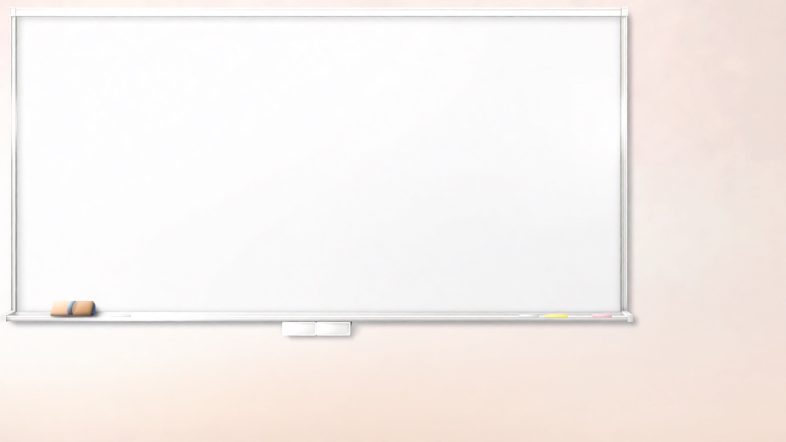
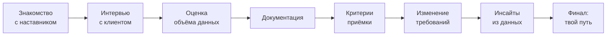

<p align="center">
  
</p>

<h1 align="center">Три грани анализа: Путь аналитика</h1>

<p align="center">
  <b>Интерактивная профориентационная новелла для студентов</b><br>
  Узнай, каким аналитиком тебе суждено стать
</p>

<p align="center">
  
  
  
  
</p>

---

## О проекте

Ты — новый сотрудник отдела аналитики. Наставник **Алексей** доверяет тебе реальный кейс: автоматизацию складского учёта для крупного клиента. По ходу проекта тебе предстоит принимать решения вместе с командой:

| Персонаж | Роль | Специализация |
|---|---|---|
| <br>**Алексей** | Наставник, руководитель отдела аналитики | Ведёт игрока по сюжету |
| <br>**Дарья** | Бизнес-аналитик | Работа с клиентом и бизнес-ценностью |
| <br>**Семён** | Системный аналитик | Архитектура, интеграции, API |
| <br>**Елена** | Аналитик данных | Метрики, прогнозы, дашборды |
| <br>**Клиент** | Заказчик проекта | Ставит задачи и меняет требования |

Каждый твой выбор в диалогах прибавляет очки одному из четырёх направлений — и в финале игра честно скажет, **какой ты аналитик**.

<p align="center">
  
  
  
</p>

---

## Игровая механика



На каждом шаге выбор игрока начисляет очки одному из направлений:

| Направление | Что развивает выбор |
|---|---|
| **Бизнес-анализ** | Работа с клиентом, выявление потребностей, бизнес-ценность |
| **Системный анализ** | Архитектура, интеграции, требования к API |
| **Анализ данных** | Метрики, прогнозы, дашборды |
| **Универсальность** | Комплексный, сбалансированный подход |

В финале побеждает направление с наибольшим числом очков — и игрок получает персональный результат с напутствием от команды:

<p align="center">
  
</p>

> *«Твой путь — БИЗНЕС-АНАЛИТИК. Ты соединяешь бизнес и технологии, находишь точки роста и создаёшь ценность.»*
> *(или системный / данные / универсальный — в зависимости от выборов игрока)*

---

## Структура проекта

```
SoloPlayer-1.0-pc/
├── SoloPlayer.exe / .sh / .py   — запуск игры
├── renpy/                       — ядро движка Ren'Py
├── lib/                          — бинарники движка под платформу
└── game/
    ├── script.rpy      — сюжет, диалоги, ветвление, подсчёт очков
    ├── screens.rpy      — экраны интерфейса (меню, настройки, сейвы)
    ├── options.rpy      — настройки игры
    ├── gui.rpy          — тема оформления
    ├── images/          — арты персонажей, локаций и финала
    ├── tl/              — папка для локализации
    └── libs/, cache/    — служебные файлы
```

---

## Запуск

| Платформа | Команда |
|---|---|
| Windows |`SoloPlayer.exe` |
| Linux / macOS | `./SoloPlayer.sh` |
| Python | `python SoloPlayer.py` (нужны папки `renpy/` и `lib/`, они уже в архиве) |

---

## Технические детали

- **Движок:** Ren'Py, совместимость со скриптами версии `8.4.1`
- **Сборка:** `Solo Player`, версия `1.0`
- **Язык:** русский (структура для локализации готова в `game/tl/`)
